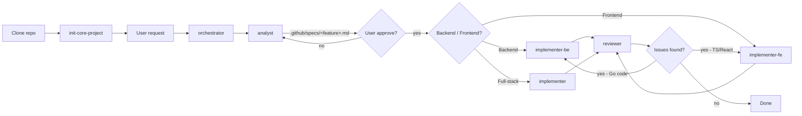

# Feature Development Workflow

Every new feature MUST go through this pipeline sequentially. **The default agent MUST NOT execute scaffold directly — it MUST dispatch to @orchestrator first.**



## Interactive Input via Chat Pop-up

Do NOT use `scaffold.sh -i` (interactive mode) in the terminal. Instead, the agent
must use the **`vscode_askQuestions` tool** to collect input from the user
via the chat pop-up, then run `scaffold.sh` with non-interactive arguments.

### Wireframe / UI Design — Template Options

Before the technical scaffold questions, the **analyst agent MUST** ask about
wireframe options first:

```
vscode_askQuestions([
  { header: "wireframe", question: "Pilihan wireframe / UI Design?", options: [
    { label: "Default template (standar CRUD layout)" },
    { label: "Custom (upload image wireframe)", description: "You will be asked to upload a UI sketch image" }
  ]},
  ...
])
```

- If user selects **Default template**: analyst writes "Default template" in the UI Design section of the spec.
- If user selects **Custom**: analyst MUST ask the user to upload a wireframe image via chat.
  After the image is received, analyst uses `view_image` → analyzes the layout → writes a detailed **UI Design** section
  (layout, components, navigation flow, colors/aesthetics if visible) to the spec.
  Analyst also MUST create a **UI manifest file** (`.github/specs/<feature>-ui.yaml`) that
  describes the layout in a structured format.

### UI Manifest File

For custom wireframes, the analyst must create a YAML manifest file that will be used
by `generate-ui.sh` to generate template overrides. Format:

```yaml
# .github/specs/<feature>-ui.yaml
version: 1
pages:
  list:
    layout: "sidebar-content"     # sidebar-content, stack, card-grid, table
    content:
      type: "card-grid"           # card-grid, table, list
      card_fields: ["title", "content", "author", "created_at"]
      card_actions: ["delete"]
      empty_state: true
  detail:
    layout: "content-right"
    header:
      back: true
      actions: ["edit", "delete"]
    content:
      fields: ["title", "content", "author", "created_at"]
```

The analyst writes this manifest based on the `view_image` analysis — layout structure,
component placement, and which fields appear on each page.

### Generate Custom UI + Scaffold

After the spec and manifest are approved by the user, the implementer runs:

```bash
# 1. Generate custom template overrides from the manifest
.github/skills/new-feature-module/scripts/generate-ui.sh <feature> .github/specs/<feature>-ui.yaml

# 2. Scaffold with --custom-ui pointing to the generate-ui output
.github/skills/new-feature-module/scripts/scaffold.sh <feature> --custom-ui /tmp/<feature>-ui [--ssr] [layers]
```

`scaffold.sh --custom-ui` will:
1. Check for templates in the custom folder first
2. If not found in custom, fall back to the skill's default template
3. Result: layout matching the user's wireframe without manual editing

### Technical Scaffold Questions

After the wireframe is clear (default or custom), the agent proceeds with
technical questions for the scaffold:

```
vscode_askQuestions([
  { header: "feature-name", question: "Feature name (kebab-case)?", options: [{ label: "task" }] },
  { header: "layers", question: "Which layers?", options: [
    { label: "h s r m p f (fullstack)" }, { label: "h s r m (backend only)" }, { label: "h p f (page only)" }
  ]},
  { header: "ssr", question: "SSR (Server-Side Rendering)?", options: [{ label: "Yes" }, { label: "No" }] },
  { header: "access-page", question: "Page access for /<feature>?", options: [
    { label: "public" }, { label: "private" }, { label: "same-origin" }
  ]},
  ...
])
```

After the user fills in the answers, the agent runs:
```bash
.github/skills/new-feature-module/scripts/scaffold.sh <feature-name> [--ssr] [layers]
```

## Step-by-step

0. **Init core** (required, once after clone) — run the `init-core-project` skill
   to create all core files from the template. Skip if already done.
1. **Orchestrator** — entry point. Log the task to the queue, dispatch to the appropriate agent based on task type.
2. **Analyst** (required) — **MUST** collect information via the `vscode_askQuestions` tool.
   The analyst MUST NOT write a spec directly without asking questions first.

   > ⚠️ **IMPORTANT — Do NOT ask all questions in a single batch!**
   > `vscode_askQuestions` is limited to ~4 questions per call. Split questions into
   > **3-4 separate batches** (see the batch list in `analyst.agent.md`):
   > - Batch 1: Wireframe + Entity + Status
   > - Batch 2: Layers + SSR + Access
   > - Batch 3: Validation + Route Details
   > - Batch 4 (complex features only): Create/Update/Delete details
   >
   > Wait for the user's answer on each batch before moving to the next.

   **First** ask about wireframe options, entity fields, and status lifecycle (Batch 1).
   - If wireframe is Custom: ask user to upload an image, then `view_image` → analyze layout.
   **Second** ask about layers, SSR, access (Batch 2).
   **Third** ask about validation and list route details (Batch 3).
   For complex features, add Batch 4 (create/update/delete details).
   Write the spec to `.github/specs/<feature>.md`. Use the `feature-spec` skill.
   - UI Design section: "Default template" if wireframe is default, or layout details
     from image analysis if custom.
3. **User review & approve** — user reads the spec, revises if needed.
4. **implementer** (index) or directly `@implementer-be` / `@implementer-fe`:
   - **Backend-only task**: call `@implementer-be` directly.
   - **Frontend-only task**: call `@implementer-fe` directly.
   - **Full-stack task**: call `@implementer` (index) — it will route to BE/FE.
   
   Read the spec from `.github/specs/`, ensure `init-core-project` has been run.
   - If UI Design section says "Default template": run the standard scaffold.
   - If UI Design section contains layout details + there is a `.github/specs/<feature>-ui.yaml` file:
     run `generate-ui.sh` first, then `scaffold.sh --custom-ui`.
   Use `vscode_askQuestions` for scaffold configuration (access, SSR, rate limit),
   then run scaffold non-interactively with user input arguments.
   Implement according to spec.
5. **reviewer** — review the implementation against the spec and architecture rules.
   - If **issues found**: reviewer describes the fix precisely → call the appropriate agent
     (`@implementer-be` for Go, `@implementer-fe` for TS/React) to fix →
     reviewer re-reviews (loop until clean).
   - If **clean**: Done.
6. **Git commit & push** — after passing review, commit and push to the feature branch.

> For small, clear features (e.g. "add GET endpoint to module X"), the analyst only needs
> to ask 1-2 questions via `vscode_askQuestions` and then provide a brief spec.
>
> When the reviewer finds issues: the reviewer MUST immediately call the appropriate agent
> (`@implementer-be` or `@implementer-fe`) with precise fix instructions,
> then re-reviews after the implementer finishes. This loop continues until all spec items
> are met and there are no issues. No user intervention is needed in this loop
> — reviewer + implementer are autonomous.
